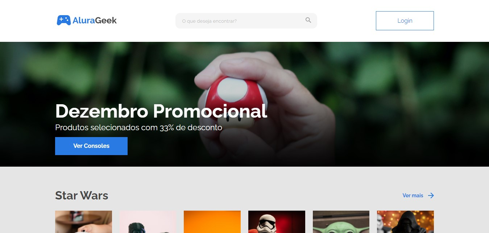
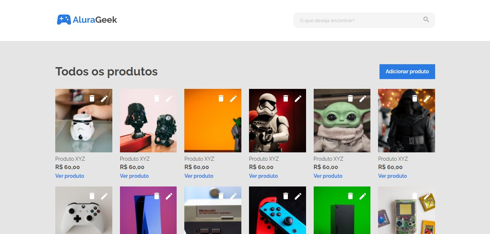

<h1 align="center"> Challenge Alura Geek </h1>

Challenge Front-End, promovido pela Alura + ONE, onde é crado o meu próprio e-commerce.

  <a href="#-tecnologias">Tecnologias</a>&nbsp;&nbsp;&nbsp;|&nbsp;&nbsp;&nbsp;
  <a href="#-projeto">Projeto</a>&nbsp;&nbsp;&nbsp;|&nbsp;&nbsp;&nbsp;
  <a href="#-layout">Layout</a>&nbsp;&nbsp;&nbsp;|&nbsp;&nbsp;&nbsp;
  <a href="#memo-licença">Licença</a>

 

  

## 🚀 Tecnologias

Esse projeto foi desenvolvido com as seguintes tecnologias:

- HTML e CSS
- JavaScript
- Git e Gitbub
- NodeJS (Contrução da API dos produtos vendidos)

## 💻 Projeto

O AluraGeek é um projeto que mostra os produtos disponíves na loja e conta com uma página para admnistrar os produtos no sistema.

  

## 🛠️ API
Você pode acessar a API do projeto e consultar todos os produtos, adicionar, editar e aidna rmeover o produto que desejar.

- `Link da API`: https://challenge-ecommerce-alura-geek.herokuapp.com

- `CRUD`: Métodos **Create, Read, Update e Delete.**

**Para o GET em um produto utilize /produtos e para um produto especifico basta utilizar /produtos/{id}, assim como para o DELETE, PUT, PATCH.**

**A API é bem prática, utilize-a o quanto desejar e deixa lá sua contribuição.**

## 🔖 Layout

Você pode visualizar o layout do projeto através [DESSE LINK](https://www.figma.com/file/itJpWbvHxSUcUeMPy1lmof/AluraGeek). É necessário ter conta no [Figma](https://figma.com) para acessá-lo.

## :memo: Licença

Esse projeto está sob a licença MIT.

